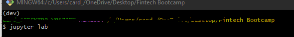
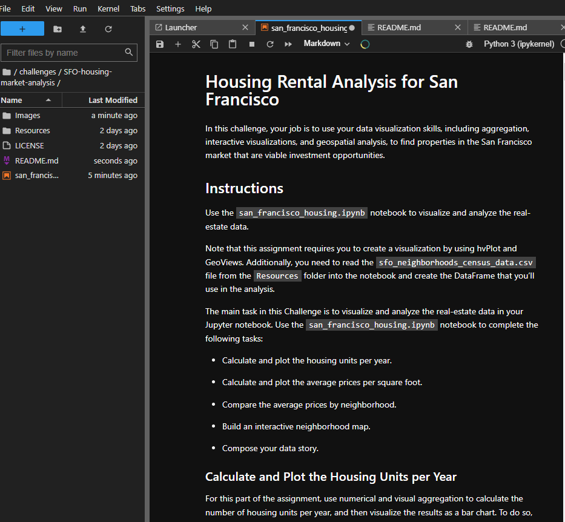
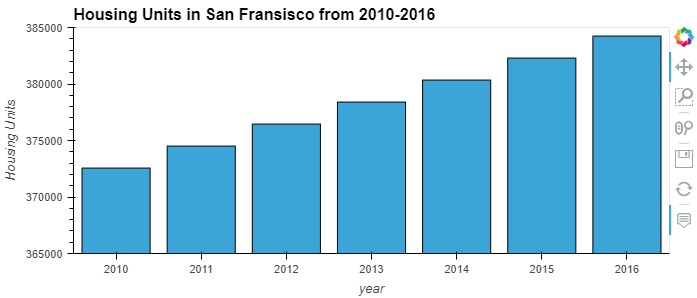
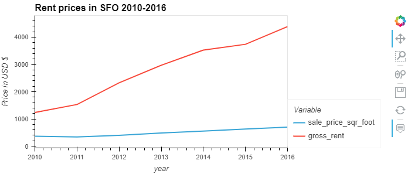
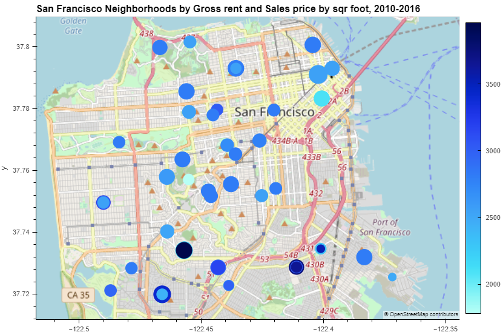

# SFO Housing Market Analysis
Challenge 6 for Fintech Bootcamp through UC Berkeley, using pandas and hvplot to do analysis on the SFO housing market. The goal of this analysis is to be able to identify trends and hot spots with regards to specific neighborhoods in SFO. Then using that information to make informed decisions on potential good locations to buy properties to rent and sell down the line. 

The notebook that does this analysis is called `san_francisco_housing.ipynb` and takes in housing sales data and SFO consensus data from 2010-2016. The notebook is stable and should work with no problems if you have the required packages and versions installed which are described below. 

---

## Technologies

To use the above-mentioned notebook, make sure you have these packages and versions or higher installed in your dev environment, if you don’t have a dev environment skip below then come back:

- python 3.7 or higher
- hvplot 0.8.1 or higher
- pandas 1.3.5 or higher 

If you are missing any of the packages above just do a simple `pip install package_name` where package_name is the name of the package you are missing.

If you don't have a dev environment or don't know what that is follow along in the steps below, otherwise you’re ready to open jupyter lab and follow along.

---

## Installation

To get your `dev` environment setup, and jupyter labs running follow along:

- Creating a dev environment for python 3.7 called 'dev' - if you do not already have an environment setup 
    - Get setup in your preferred CLI (Gitbash, terminal, etc)
    - `conda create -n dev python=3.7 anaconda`
    - Once you have created the environment, type the following to activate and deactivate.

- Once your  `dev`  env is setup, go ahead and navigate to the same directory as the newly cloned repo, and then type  `juypter lab`  in your console.

- That’s it! Then your in, you should see something similar to the screenshot below.

---

## Usage and Results

Once you are in the notebook you should have no issues running all the cells and following along the logic to get the graphs displayed below. One of the first things I analyzed was simply the amount of housing units in SFO over the six-year timeframe. The results can be visualized below:

In the graph above it is clear to see that the amount of Housing units in SFO continues to grow year over year. 
With a clear growth in amount of Housing units, I next went to analyze the gross rent over the years as well as the sales price per square foot. The results can be seen below:

This graph is taking in data for all the neighborhoods and averaging them out per year. We can again see a clear uptrend for the gross rent (orange line) and a small uptrend in the sales prices by square foot (blue line). I wanted to see if this trend continued through each neighborhood or if there were some anomalies to the trend. So, I made the same chart but separated each neighborhood so I could individually examine each one. After doing this I noticed that the gross rent trend held true across all neighborhoods, however, not all neighborhoods had the same trend when coming to sale prices per square foot. There were some neighborhoods that experienced a negative trend, with the prices going down per square foot vs up, and others that remained relatively neutral. 

With this conclusion, I wanted to visualize all the neighborhoods via a geomap, filtering for gross rent (color scale) and sales price per square foot(size of circle) the result can be seen below:

This graph in the notebook allows us to hover over each dot and see the info related to each neighborhood. Making it easy to quickly glance and see the neighborhoods with the most rent, or the highest price per square foot. 

Finally, back to my goal with trying to find some good neighborhoods that could potentially serve as possible investments. We are looking for neighborhoods with an increase in sales price over the years, so we don't risk buying something that loses value over time. But also has high rent so we can rent it out for a profit. Just to name a few of the neighborhoods in SFO - Russian Hill, Midtown Terrace, Westwood Highlands, and Downtown- seem like a good place to focus more research on home values etc. to get an idea of good investments in the area that would prove profitable for renting and selling in the future. 

---
## Contributors

[Robin Thorsen](https://www.linkedin.com/in/robin-thorsen-079819120/) was the main developer/analyst working on this project. Starter code and resources provided by UC Berkeley.

Best reached via email - robinbthorsen@gmail.com

---

## License

Apache 2.0 public License applied, feel free to clone and fork and use and reach out if you have questions. 

